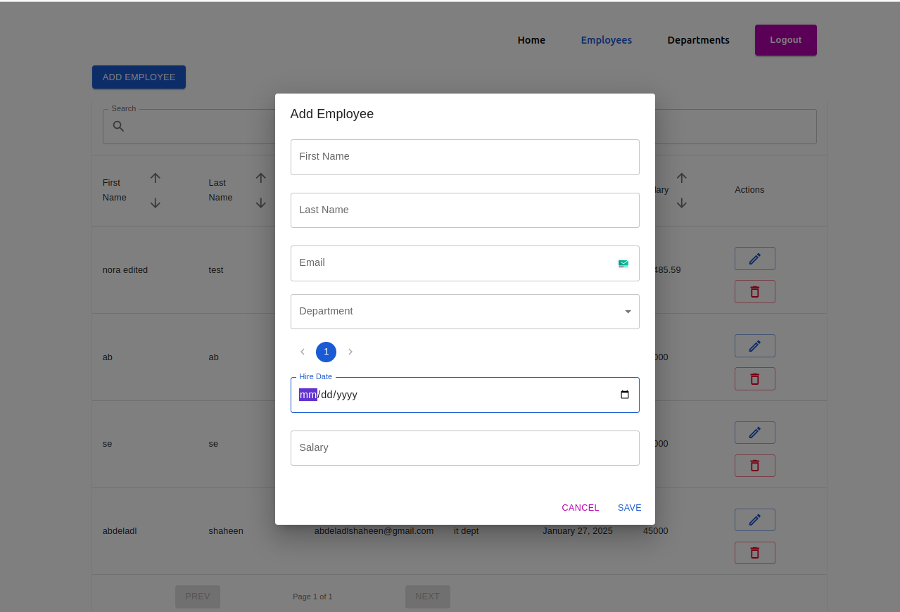
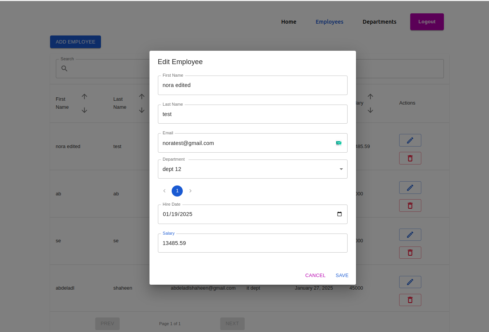
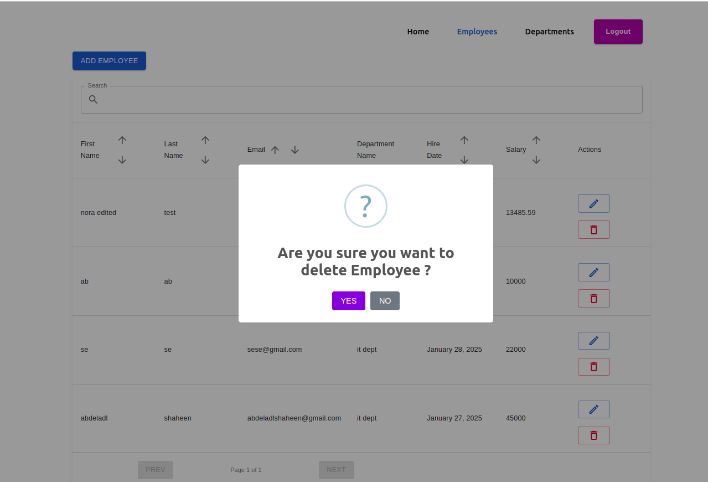
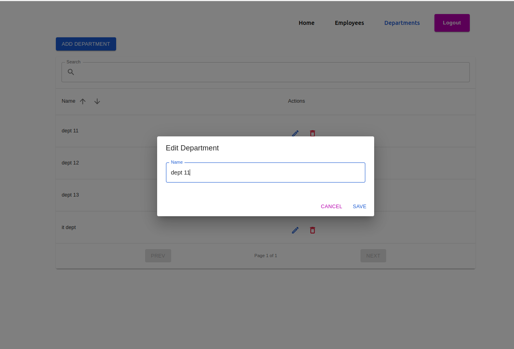
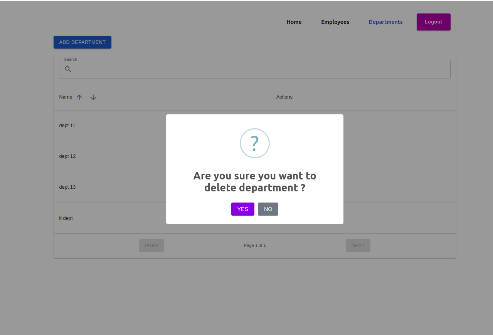

# Getting Started with Create React App

### 1 - run `npm run install` to install packages

### 2 - create `.env` file like .env-example

    - add backend url like: http://localhost:1337/

### 3 - run `npm start` to run project

### `npm run build` to build project

### Login Screen

### Dashboard Screen

### Employees Screen

### CREATE Employees Screen

### UPDATE Employee Screen

### DELETE Employee Screen

### Departments Screen

### CREATE Department Screen

### UPDATE Department Screen

### DELETE Department Screen

